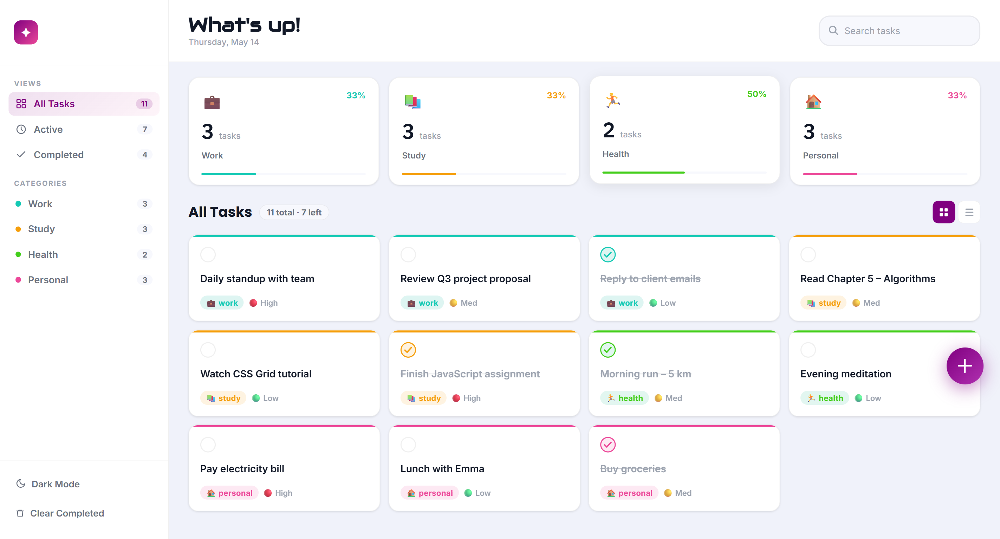

# 📝Taskly - Task Management App

A modern and responsive task management web application built with HTML, CSS, and vanilla JavaScript. Taskly helps users organize daily tasks by category, priority, and completion status through a clean dashboard-style interface.

## 🚀 Live Demo

https://to-do-app-gamma-dun.vercel.app/

## 📸 Preview

### Responsive Design

| Desktop | Mobile |
|---|---|
|  |  |

## ✨ Features

- ➕ Create and add new tasks
- ✅ Mark tasks as completed
- 🗑️ Delete tasks
- 🧹 Clear completed tasks
- 🔍 Search tasks
- 🎯 Set task priority
- 📂 Organize tasks by category
- 📊 Track task progress
- 🔎 Filter tasks by status/category
- 📱 Responsive design for desktop and mobile
- 🌓 Clean and user-friendly dashboard interface

## 🛠️ Tech Stack

- HTML5 — semantic page structure
- CSS3 — responsive styling and layout
- JavaScript (ES6+) — application logic and DOM manipulation
- Git & GitHub — version control and repository management
- GitHub Pages — deployment

## 💻 Run Locally

Clone the repository:

git clone https://github.com/sasamir10/to-do-app.git

Navigate to the project folder:

cd to-do-app

Then open index.html in your browser.

## 🎯 Purpose

This project was built to strengthen my understanding of JavaScript fundamentals, DOM manipulation, event handling, responsive UI development, and building interactive frontend applications without a framework.

## 🔮 Future Improvements
- 💾 Persist tasks using Local Storage
- ✏️ Edit existing tasks
- 🔔 Add due dates and reminders
- 🔐 Add user authentication
- ☁️ Store tasks using a backend/database

## 👨‍💻 Author

Sabbir Ahmed Samir

GitHub: @sasamir10
